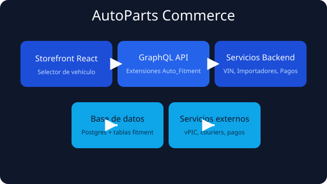

# AutoParts Commerce



AutoParts Commerce es una plataforma eCommerce especializada en repuestos automotrices. El proyecto proporciona un catálogo centrado en compatibilidad (fitment), un selector de vehículo orientado a VIN y flujos de importación masiva para mantener la información actualizada sin procesos manuales complejos.

> 🤝 **Créditos**: este desarrollo evoluciona el código abierto de EverShop y reconoce el trabajo de su comunidad original.

## Características clave

- **Compatibilidad vehículo-producto** mediante la extensión `Auto_Fitment`, con GraphQL y servicios dedicados para Año/Marca/Modelo/Versión/Motor.
- **Selector de vehículo + VIN** en el storefront, respaldado por la extensión `Auto_VIN` y la API pública de vPIC.
- **Importadores CSV** para catálogo, compatibilidad y referencias cruzadas que permiten poblar el sistema de forma masiva.
- **Arquitectura modular** basada en extensiones (`extensions/*`) que encapsulan pagos locales, reglas de envío y búsqueda especializada.

## Guía rápida de entorno

1. Copia el archivo `.env.example` si es necesario y ajusta credenciales.
2. Levanta los servicios de infraestructura:
   ```bash
   docker-compose up -d
   ```
3. Inicializa la base de datos y crea el usuario administrador:
   ```bash
   npm install
   npm run setup
   ```
4. Ejecuta el entorno de desarrollo:
   ```bash
   npm run dev
   ```

## Fases del proyecto



| Fase | Objetivo | Entregables principales |
|------|----------|-------------------------|
| **Fase 1. MVP operativo** | Poner en marcha la tienda con compatibilidad básica. | Infraestructura Docker, migraciones fitment, selector VIN, importadores CSV, filtro de compatibilidad en storefront. |
| **Fase 2. Escalamiento** | Robustecer búsqueda, logística y pagos. | Integración Meilisearch/Typesense, reglas de envío avanzadas, pagos locales multi-moneda, dashboards de compatibilidad. |
| **Fase 3. Optimización** | Preparar crecimiento sostenido. | Automatización de catálogo, analítica avanzada, pruebas automatizadas, integraciones premium (TecDoc). |

## Estado actual

- **Fase activa:** Fase 1 · MVP operativo.
- **Entregables listos:** estructura de extensiones autoparts, documentación de roadmap, assets de arquitectura.
- **Pendientes para cerrar la fase:**
  - Provisionar entorno Docker y ejecutar `npm run setup` para validar las migraciones de `Auto_Fitment`.
  - Finalizar servicios de compatibilidad y completar los importadores CSV en el admin.
  - Integrar selector de vehículo y toggle de compatibilidad en el storefront.

Una vez completados estos puntos, podremos avanzar hacia la Fase 2 centrada en escalamiento.

## Ruta recomendada (roadmap de alto nivel)

1. **Infraestructura**: automatizar despliegue local (Docker, seeds), preparar pipelines CI/CD y monitoreo básico.
2. **Dominio autopartes**: culminar compatibilidad, atributos de producto y lógica de core charge.
3. **Experiencia de compra**: refinar checkout con envíos regionales y pagos locales, añadir búsqueda mejorada.
4. **Escalamiento y analítica**: habilitar multi-almacén, métricas de compatibilidad y contenido SEO específico.

## Licencia

El proyecto mantiene la licencia [GPL-3.0](LICENSE) del código base.
